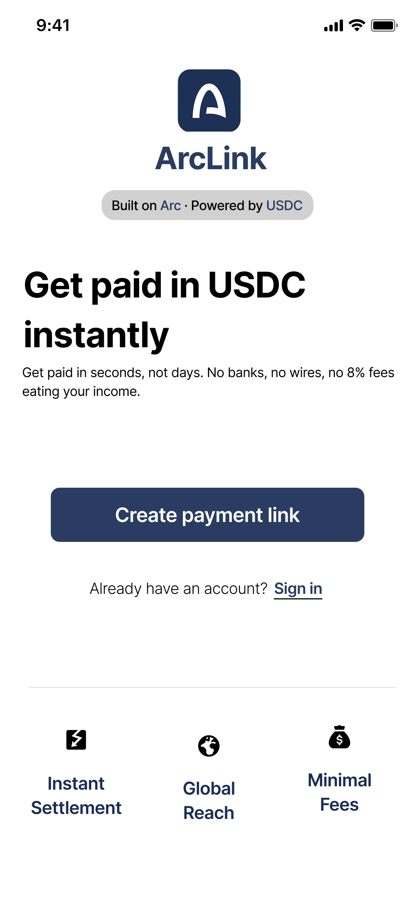
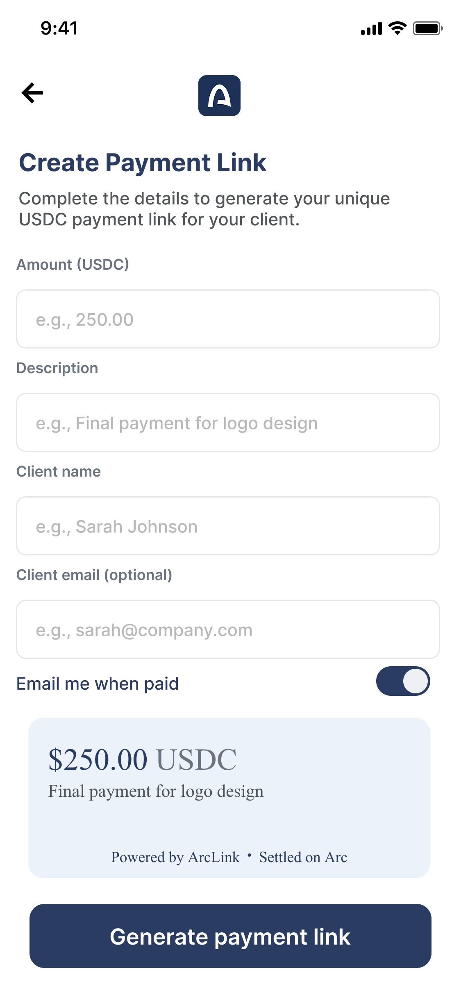
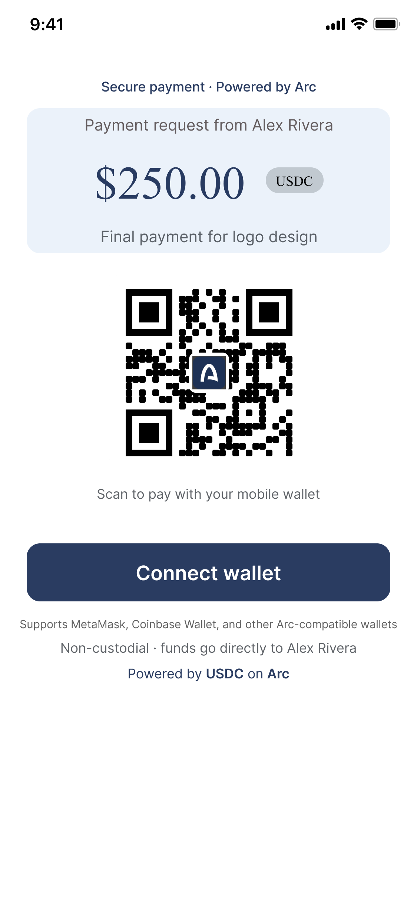
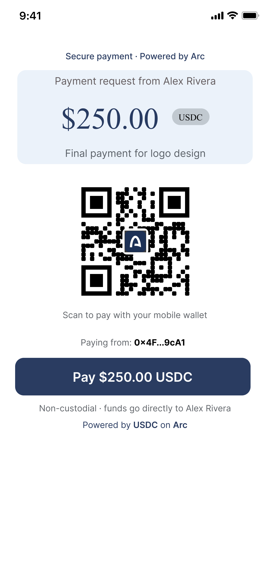
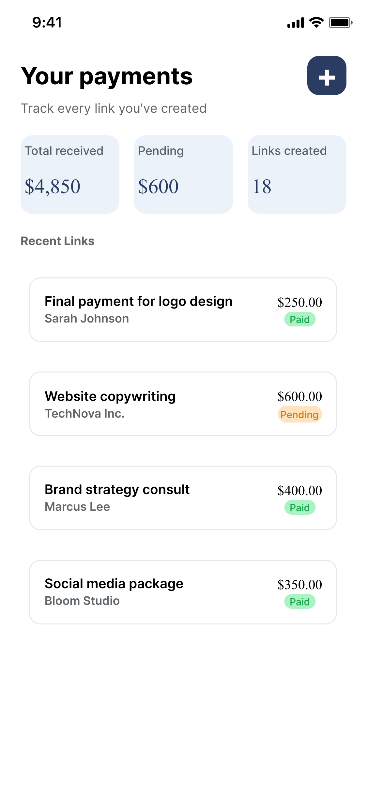
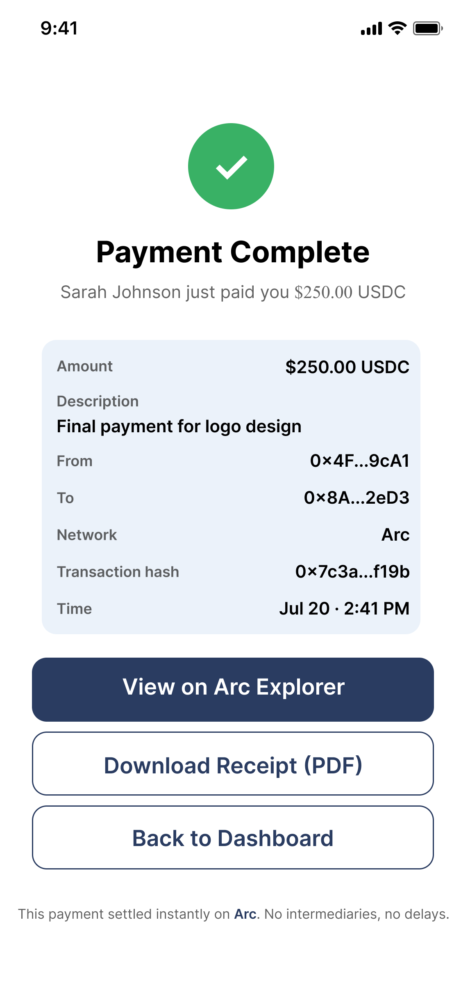

# ArcLink

**Instant USDC payment links - built on Arc.**

> A stablecoin-native Stripe alternative for freelancers in emerging markets.

Get paid in seconds, not days. No banks, no wires, no 8% fees eating your income.

---

## 🔗 Live Prototype

[View the ArcLink Figma Prototype](https://www.figma.com/proto/2HZnPlq6D3c5pZUTxW88af/ArcLink---Home?node-id=16-2789&p=f&t=mT3wB5L0rdkF5bKb-0&scaling=min-zoom&content-scaling=fixed&page-id=16%3A103&starting-point-node-id=16%3A2789)

[Watch the 45-second demo video](https://www.loom.com/share/f2737a72fa4e46bca04f28217bd60b52) 

---

## The Problem

Freelancers and small businesses who invoice international clients are stuck with slow, expensive payment rails:

- **PayPal / Wise:** 3–8% in fees, 2–5 business days to settle
- **Bank wires:** $25–45 flat fees, multi-day delays, full banking details required
- **Availability:** many of these platforms are restricted or unavailable entirely in large parts of the world

For a freelancer waiting on a $250 invoice, that's real money lost and real time lost - every single time they get paid.

## The Solution

**ArcLink** is a lightweight payment-link tool - think "Stripe Payment Links, but for USDC on Arc."

1. A freelancer creates a payment link in seconds - just an amount and a description
2. They share the link (or QR code) with their client via WhatsApp, email, or text
3. The client opens the link, connects a wallet, and pays in USDC
4. The payment settles on **Arc** in seconds, and the freelancer's dashboard updates instantly

No custody, no smart contract complexity for v1 - just a clean, direct wallet-to-wallet USDC transfer, wrapped in a payments experience anyone can understand.

## Why Arc

USDC is the actual currency being sent - not a wrapped asset or an intermediary token. **Arc** was chosen specifically because it's a stablecoin-native chain: fast finality and low, predictable fees are what make *small* invoices (a $50–500 freelance payment) actually practical. On most general-purpose chains, gas costs alone can eat into a payment that size - Arc is built for exactly this use case.

## Key Features

- **Instant Payment Link Generator** - enter an amount and description, get a shareable link + QR code
- **Client Checkout Page** - a clean, non-crypto-native checkout experience: "Pay $250 USDC," scan or connect a wallet
- **Live Payment Dashboard** - track every link's status (Paid / Pending), amounts received, and links created
- **Instant Receipt** - an automatic on-chain confirmation once a payment lands, with a transaction hash and full details

## Screens

| #  | Screen              | Purpose                                |
|----|---------------------|----------------------------------------|
| 01 | Landing Page        | Value proposition + entry point        |
| 02 | Create Payment Link | Freelancer generates a link            |
| 03 | Client Checkout     | Client pays via QR or connected wallet |
| 04 | Dashboard           | Freelancer tracks all payment links    |
| 05 | Receipt             | Confirmation + transaction details     |

*(All UI screens available in `/design`)*

## User Flow & Screens

1. Freelancer opens ArcLink → **Create Payment Link**

2. Enters amount, description, and client details
The freelancer generates a payment link with custom client metadata and sets the toggle preferences.

3. Shares the generated link / QR code with the client

4. Client opens the link → connects a wallet → pays in USDC

5. Payment settles on Arc → freelancer's dashboard updates to **Paid**

6. Both sides get a receipt with the full transaction record

## Built With

- **Figma** - full UI/UX design and clickable prototype
- **Arc** - stablecoin-native settlement layer
- **USDC** - the payment currency itself

*(Planned for the working build: React, wagmi/RainbowKit for wallet connection, and Arc testnet USDC for live transactions.)*

## Roadmap

- [ ] Working testnet build (real wallet connection + USDC transfer on Arc testnet)
- [ ] **Circle Wallets** integration - let non-crypto-native clients pay without needing their own wallet app
- [ ] **CCTP** integration - allow clients to pay with USDC from any chain, landing natively on Arc
- [ ] Milestone / escrow-style payment links for larger invoices
- [ ] Multi-invoice batch links for agencies paying multiple freelancers at once

## Feedback Wanted

I'd love feedback on the core payment-link checkout UX - specifically whether a non-crypto-native client would feel comfortable connecting a wallet and paying, or whether a Circle Wallets-based flow is needed to remove that friction entirely. Also open to thoughts on whether a lightweight escrow/milestone feature would meaningfully increase trust for larger invoices.

## About

Built by **Areeb**, a Software Engineering student, as part of learning to build real-world payment products in the Arc ecosystem.

---

*Built on Arc · Powered by USDC*
